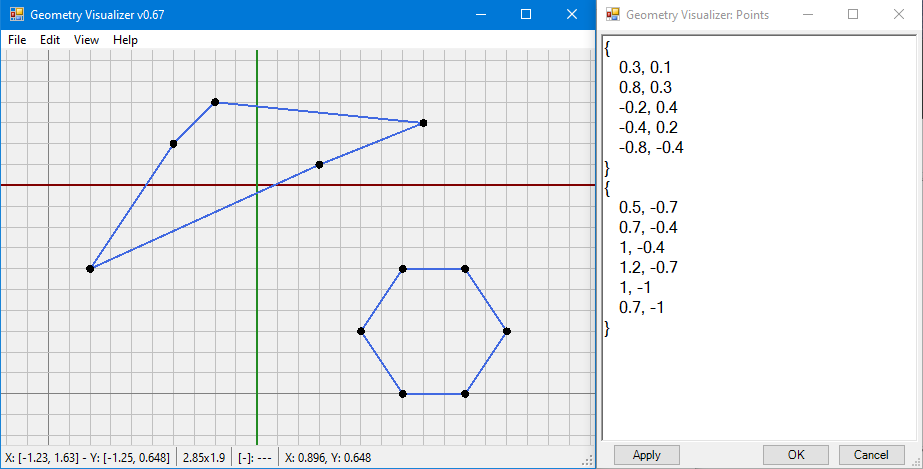

# Summary
Geometry visualizer app used to plot 2D/3D coordinates, lines, and polygons for Windows desktop.

# Description
GeoViz provides a simple 2D coordinate data plot, sourced from parsing manually input or pasted plain-text (such as from a Visual Studio quick watch) and extracting 2D/3D coordinates -- as well as polygons grouped by curly-braces. Display currently only supports 2D, but I plan to extend to 3D as the internal parser already handles Z coordinates, so it's just a matter of enhancing the viewer (and maybe making a simple GDI+ 3D renderer. :).

(GeoViz screenshot showing main plot window and pop-up text editor)

# Usage

TODO:

---
Created by Taber with a computer.
